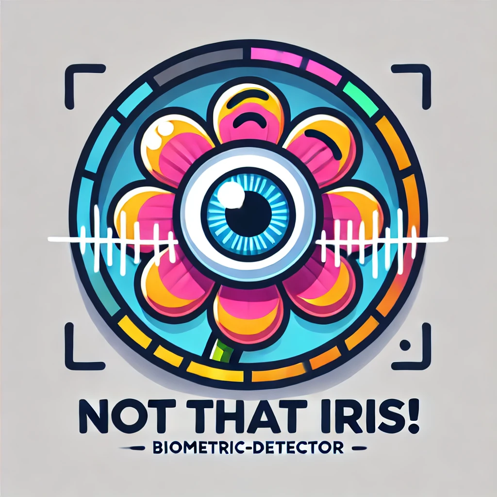

<p align="center">
    
</p>
<p align="center"><h1 align="center">NOT THAT IRIS! DETECTOR</h1></p>
<p align="center">
	
	
	

## 🔗 Table of Contents

- [🔗 Table of Contents](#-table-of-contents)
- [📍 Overview](#-overview)
- [👾 Features](#-features)
- [🚀 Getting Started](#-getting-started)
  - [☑️ Prerequisites](#️-prerequisites)
  - [⚙️ Installation](#️-installation)
  - [🤖 Usage](#-usage)
    - [Train each modules](#train-each-modules)
      - [Train RESNET-50](#train-resnet-50)
      - [Train DRCT](#train-drct)
      - [Train Adapter model](#train-adapter-model)
      - [Train MLP](#train-mlp)
  - [Matcher](#matcher)
- [🔰 Contributing](#-contributing)
- [🎗 License](#-license)

---

## 📍 Overview

Not That Iris! Detector is a biometric recognition system designed to identify individuals based on their iris patterns, even from standard front-facing smartphone selfies. Leveraging advanced deep learning techniques, the project addresses the challenge of low-detail iris images by incorporating super-resolution models to enhance image quality and improve biometric matching accuracy.

---

## 👾 Features

1. Biometric Pipeline: A robust system encompassing preprocessing, feature extraction, and matching methodologies.
   - Preprocessing: Includes segmentation, reflection removal, and normalization using techniques like the Hough Transform.
   - Feature Extraction: Utilizes fine-tuned ResNet-50 and an Adapter Model for domain-specific embedding optimization.
   - Matching: Employs both vector-based and MLP-based classifiers for high-accuracy recognition.
2. Super-Resolution Integration: Enhances iris images using the Dense-Residual-Connected Transformer (DRCT), a state-of-the-art model, to improve the reliability of biometric matching.
3. Dataset Customization: Utilizes public datasets like CASIA-IrisV4 Thousand and Lamp, supplemented with tailored data augmentation for realistic smartphone scenarios.
4. Performance Evaluation: Implements metrics such as F1-score, FAR (False Acceptance Rate), FRR (False Rejection Rate), and ROC analysis to quantify system accuracy and reliability.


## 🚀 Getting Started

### ☑️ Prerequisites

Before getting started with Not That Iris! Detector, ensure your runtime environment meets the following requirements:

- **Virtual Enviroment Manager:** Conda
- **Programming Language:** Python
- **Package Manager:** Pip


### ⚙️ Installation

Install Not That Iris! Detector using one of the following methods:

**Build from source:**

1. Clone the NotThatIris-Detector repository:
```sh
❯ git clone https://github.com/JustCati/NotThatIris-Detector
```

2. Navigate to the project directory:
```sh
❯ cd NotThatIris-Detector
```

3. (Optional) Create a virtual enviroment:
```sh
❯ conda create --name NotThatIrisDetector python=3.11.9
❯ conda activate NotThatIrisDetector
```

4. Install the project dependencies:


**Using `pip`** &nbsp; [](https://pypi.org/project/pip/)

```sh
❯ pip install -r requirements.txt
```


### 🤖 Usage
Run Not That Iris! Detector using the following command:
**Using `pip`** &nbsp; [](https://pypi.org/project/pip/)

#### Train each modules
##### Train RESNET-50
```sh
❯ python train_RESNET.py --dataset_path <folder_path> --output_path <path> --num_epochs <num>  --batch_size <num>
```

##### Train DRCT
```sh
❯ python train_DRCT.py <path_to_config_file> --path <path>
```

##### Train Adapter model
```sh
❯ python train_RESNET.py --feature_model_path <path_to_resnet_checkpoint> --dataset_path <folder_path> --output_path <path> --num_epochs <num>  --batch_size <num>
```

##### Train MLP
```sh
❯ python train_RESNET.py --feature_model_path <path_to_resnet_checkpoint> --adapter_model_path <path_to_adapter_checkpoint> --dataset_path <folder_path> --output_path <path> --num_epochs <num>  --batch_size <num>
```

### Matcher
```sh
❯ python train_RESNET.py ["vector", "mlp"] --feature_model_path <path_to_resnet_checkpoint> --adapter_model_path <path_to_adapter_checkpoint> --mlp_model_path <path_to_mlp_checkpoint> --sr_model_path <path_to_sr_checkpoint> --dataset_path <folder_path> --out_path <path> --num_epochs <num>  --batch_size <num>
```

---


## 🔰 Contributing

- **💬 [Join the Discussions](https://github.com/JustCati/NotThatIris-Detector/discussions)**: Share your insights, provide feedback, or ask questions.
- **🐛 [Report Issues](https://github.com/JustCati/NotThatIris-Detector/issues)**: Submit bugs found or log feature requests for the `NotThatIris-Detector` project.
- **💡 [Submit Pull Requests](https://github.com/JustCati/NotThatIris-Detector/blob/main/CONTRIBUTING.md)**: Review open PRs, and submit your own PRs.

<details closed>
<summary>Contributing Guidelines</summary>

1. **Fork the Repository**: Start by forking the project repository to your github account.
2. **Clone Locally**: Clone the forked repository to your local machine using a git client.
   
   ```sh
   git clone https://github.com/JustCati/NotThatIris-Detector
   ```
3. **Create a New Branch**: Always work on a new branch, giving it a descriptive name.
   ```sh
   git checkout -b new-feature-x
   ```
4. **Make Your Changes**: Develop and test your changes locally.
5. **Commit Your Changes**: Commit with a clear message describing your updates.
   
   ```sh
   git commit -m 'Implemented new feature x.'
   ```
6. **Push to github**: Push the changes to your forked repository.
   ```sh
   git push origin new-feature-x
   ```
7. **Submit a Pull Request**: Create a PR against the original project repository. Clearly describe the changes and their motivations.
8. **Review**: Once your PR is reviewed and approved, it will be merged into the main branch. Congratulations on your contribution!
</details>

<details closed>
<summary>Contributor Graph</summary>
<br>
<p align="left">
   <a href="https://github.com{/JustCati/NotThatIris-Detector/}graphs/contributors">
      
   </a>
</p>
</details>

---

## 🎗 License

This project is protected under the MIT LICENSE. For more details, refer to the [LICENSE](./LICENSE) file.

---
